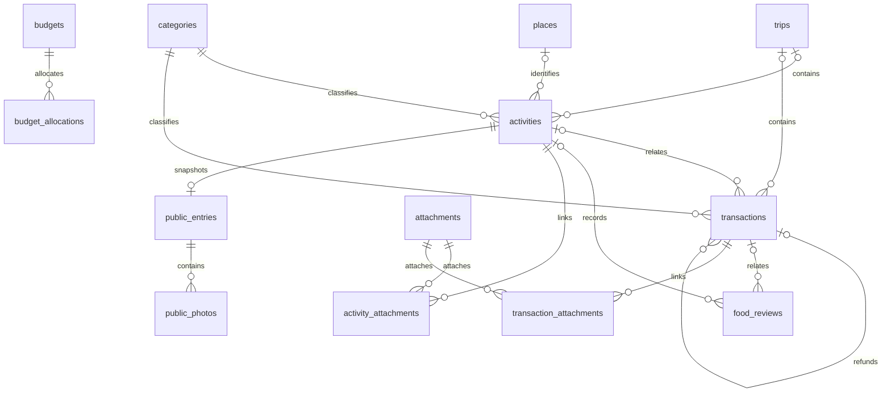

# TravelMap 新データモデル

旅の記録と家計を分離し、必要なところで関連づける、個人用モデルの参照実装。
SQLiteはオフライン検証用。本番の保存方式を決定するものではない。
Python 3.11以上とSQLite 3.37以上を使用。外部パッケージ・認証・ネットワークは不要。

## Phase 1：モデル

正本は `schema.sql`（制約）、`model.py`（変換・集計・公開境界）、この文書。
9つの業務上のまとまりを、関連・公開写真・来歴も含む17テーブルで表す。
`schema_version` は別の管理テーブル。

| まとまり | テーブル | 内容 |
|---|---|---|
| 旅 | trips | 日程、説明。終了日未定可 |
| 行動 | activities | 0〜1旅、日時・タイムゾーン、行動分類、当時の場所名・座標、評価、メモ |
| 場所 | places | 確認した施設。同名・近い座標で自動統合しない |
| お金 | transactions | 支出・収入・返金。行動なしの家計記録も可 |
| 分類 | categories | 行動・支出・収入の別、固定ID、表示名、色、順序、廃止フラグ |
| 予算 | budgets / budget_allocations | 月または旅の総額と分類別内訳 |
| 食事 | food_reviews | 料理・順位・評価。行動・場所・支出との関連は任意 |
| 添付 | attachments / activity_attachments / transaction_attachments | 非公開の写真・領収書。複数支出で同じ領収書を参照可 |
| 公開 | public_entries / public_photos | 選択した文章・日付・場所名・写真の独立した複製 |
| 移行来歴 | import_batches / source_records / source_targets / category_aliases | 原文、型、出典、ハッシュ、変換先、要確認理由、旧分類との対応 |



備考：複数人利用、口座残高、カード、振替、立替精算、RPGステータスは対象外。
既存画面・Firebaseルール・Hosting設定は変更しない。現在の公開範囲はこの実装では変わらない。

## Phase 2：金額・日時・分類

- 金額は通貨の最小単位の整数。例：USD 12.99 → `amount_minor=1299, minor_unit=2`。
  通貨コードは大文字3文字。通貨と桁数の正しい組合せは入力側の通貨台帳で指定する。
- 円換算は未換算・概算・確定。確定値の上書きは拒否する。JPYは整数円で確定。
  未換算は0円扱いせず件数を返す。`net_cashflow_jpy` は収支差であり口座残高ではない。
- 返金は元支出を参照し支出から控除。同通貨・分類・旅に限定し、原通貨の累計返金額は元額以下。
  異通貨での返金や確定済み取引の訂正ワークフローは未対応。
- 月集計は取引日時の日本時間。旅集計は旅ID。両方指定すれば積集合。
  総予算に分類内訳を加算しない。内訳合計が総額を超える変更は拒否する。
- 日時はUTCへ正規化し、行動のタイムゾーンを別に持つ。旧ログの `Asia/Tokyo` は推定として明記。
  他の地域はIANAタイムゾーンを検証する。OSにゾーン情報がない場合は `tzdata` が必要。
- 行動の旅変更は `move_activity` を使い、関連取引と一括更新する。
  別行動に属する返金との整合を保てない変更はロールバックする。
- 旧14分類を行動用・支出用の各14件に分離。新しい意味や分類名は推測しない。
  `作業` → `場所代場所代作業` は元IDと表示名を保存した対応表で解決。
  今後の分類整理は固定IDを残して行う。施設への集約・旅の割当・架空の予算作成はしない。

## Phase 3：バックアップからの変換

リポジトリ直下で実行する。出力DBは必ずリポジトリ外に置く。

```powershell
python data_model/model.py import --database ../github-account-migration/data-backups/travelMap-model-v1.sqlite --backup ../github-account-migration/data-backups/travelMap-2026-09-08T06-00-30-628Z
python data_model/model.py verify --database ../github-account-migration/data-backups/travelMap-model-v1.sqlite --backup ../github-account-migration/data-backups/travelMap-2026-09-08T06-00-30-628Z
```

- manifest内の全ファイルの長さ・SHA-256、コレクション件数を検証してから変換する。
- Firestoreドキュメントの原文は型付きREST形式を保持。RTDB全ルートも保持し、未知の値・優先度を落とさない。
- 同じバックアップの再実行では追加しない。別スナップショットは新規DBで検証する。
  差分同期ツールではない。未知の形式は要確認、想定外のDBエラーはバッチ全体をロールバック。
- Firestoreログは各1行動。金額未入力は取引を作らず、0円は0円の取引を作る。
- 旧ログは日時・緯度・経度・メモ・金額・分類が一致し、双方に候補が1つのときだけ紐づける。
  同じ出典の似たログは統合しない。6項目以外の差は元データに残る。
- 一致しないログは `needs_review` のまま集計対象外。レビューは記録を読んで個別判断する段階であり、
  自動承認・要確認解消CLIは作っていない。
- 食事ランキングは食事レビューとして保存。金額は参考価格で、支出に重複計上しない。

備考：バックアップと変換DBには非公開情報が含まれる。Git・Hostingに配置しない。
元バックアップのAuthユーザー・Storageファイルは対象外。

## Phase 4：添付と公開

Python APIを使い、`register_attachment` で元ファイルの場所・ハッシュと関連先を登録する。
写真も領収書も非公開。元ファイルの移動・保管自体はこのモデルの責任外。

`prepare_public_entry` に公開用の日付・文章・場所名・写真IDを明示すると下書きになる。
`set_public_status(..., published=True)` で選択した下書きを公開対象にする。
`public_feed` は公開スナップショットだけを読み、原文・家計・元画像のパス・座標を返さない。
原文を変更しても公開複製は変わらない。公開解除は `published=False`。

写真は静止PNGのみ受け付け、EXIF・テキストなど付随情報を除去して複製する。
JPEG等は事前にローカルでPNGへ変換する。領収書の公開は拒否。
画面に写り込んだ住所などの内容は消さないので、公開内容は本人が選ぶ。

```powershell
python data_model/model.py public-export --database ../github-account-migration/data-backups/travelMap-model-v1.sqlite --output ../github-account-migration/data-backups/travelMap-public.json
```

備考：DB全体を公開APIに接続しない。将来のサーバーでは非公開データへの本人認証と、
この公開出力のみを配信する経路が必要。現行Firebaseにその制限を適用した状態ではない。

## Phase 5：検証・切り替え

```powershell
npm run test:model
python data_model/model.py restore-test --database ../github-account-migration/data-backups/travelMap-model-v1.sqlite --output ../github-account-migration/data-backups/travelMap-model-v1-restored.sqlite
```

全件照合・再実行による内容不変・復元・復元後の全件照合を一括実行して記録する場合は、
`validate_migration.py --database <DB> --backup <バックアップフォルダ> --restore <新規復元DB> --report <新規JSON>` を使う。

復元先は未作成のファイルを指定。復元後の全テーブルの内容ハッシュ・外部キー・DB整合を検証する。
これは新しいSQLiteモデルの復元試験であり、元Firebase環境の復元試験ではない。
外部添付ファイルはSQLiteの復元に含まれない。公開用写真の複製はDB内に含まれる。

本番切り替え前に、要確認の解消、保存方式、本人認証、画像保管、画面接続、
本番書き込み停止点と以後の差分、移行先での読戻しと復旧方法を確定する。
切り替え直前の承認は別途必要。現段階の復旧は新モデルを使用せず既存画面を継続すること。
